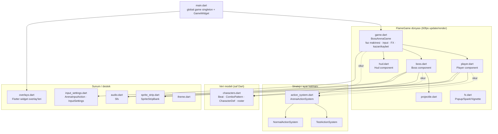
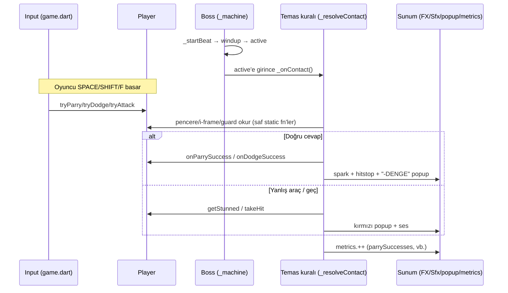
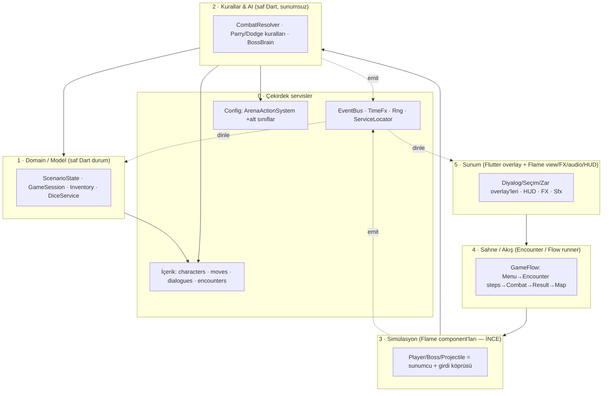
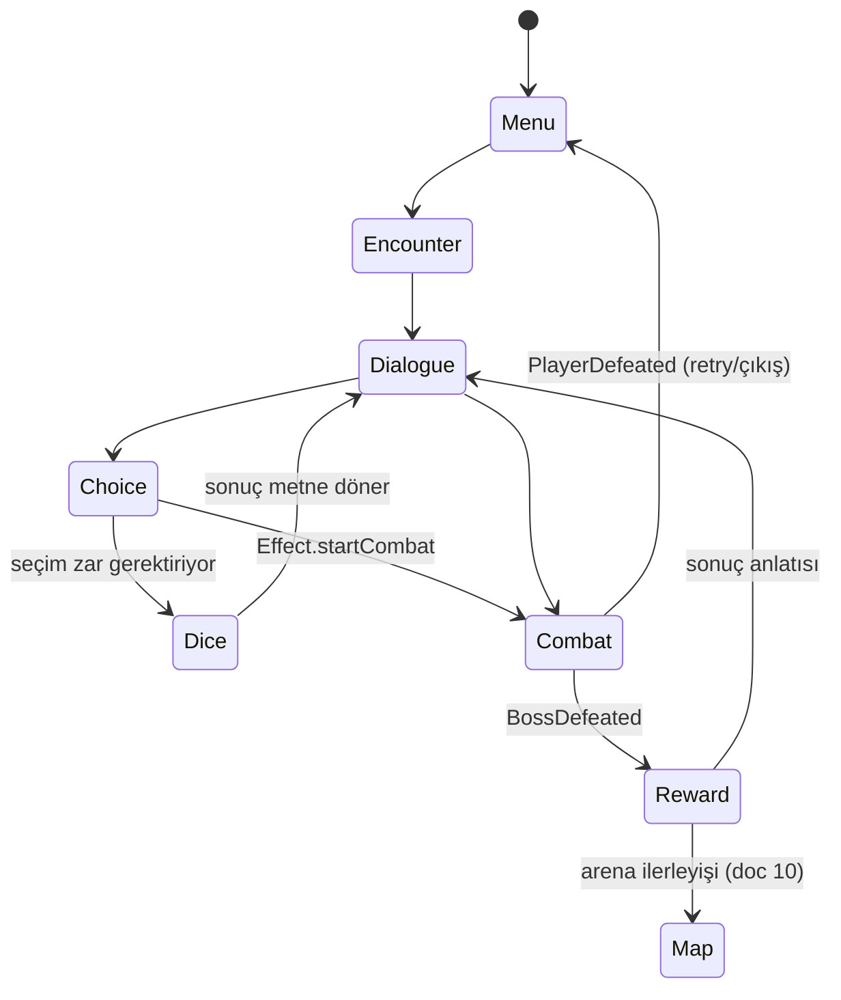

# Mimari Referansı — Boss Parry Arena → RPG'li Ürün

> **Bu, projenin tek kanonik mimari dokümanıdır.** İki taslağın (Claude + Codex)
> birleşimidir: repo-grounded denetim, diyagramlar ve göç planı (gövde) + combat
> veri modeli, mekanik↔asset kontratı ve içerik pipeline standartları (modüller).
>
> **Amaç:** (a) **mevcut** mimariyi dosya-dosya belgelemek; (b) darboğazları somut
> kanıtla göstermek; (c) "vibe coding"den **yapısal, yönetilebilir** bir mimariye —
> combat + diyalog + seçim + zar (RPG) sistemlerini birlikte taşıyacak şekilde —
> geçişin **hedef tasarımını** vermek; (d) "yeni karakter / seçim / sahne nasıl
> eklenir" reçetelerini ve combat'ı bozmadan **fazlı göç yol haritasını** sunmak.
>
> Bu doküman `doc/todo/01..16` özellik notlarının **şemsiyesidir**: o notlar "ne"
> eklenecek der; bu doküman "hangi yapıya" ekleneceğini söyler.

**Çekirdek ilke:**
```text
Simulation is the truth.      → Mekanik gerçek, state machine + timeline verisinde.
Presentation explains it.     → Sprite/ses/VFX/UI o gerçeği oyuncuya anlatır.
Content feeds it.             → Karakter/diyalog/zar/encounter veri olarak girer.
```
Bir boss, bir seçim veya bir zar sonucu eklemek için **engine koduna minimum
dokunulur.** Strateji deseni (`ArenaActionSystem`) bu felsefenin halihazırdaki
kanıtıdır — onu tüm sisteme yayıyoruz.

---

## 0. Hızlı Sözlük

| Terim | Anlamı (bu projede) |
|---|---|
| **Beat** | Bir komboyu oluşturan tek vuruş. Zamanlama + savunma profili + hasar verisi taşır. |
| **MoveDef** *(hedef)* | Bir aksiyonun mekanik gerçeği (timeline + maliyet). Beat = bir move'un kombo-içi örneği. |
| **ActionTimeline** *(hedef)* | Bir aksiyonun pencerelerini (windup/active/parry/iframe…) birinci-sınıf veri olarak tutan zaman çizelgesi. |
| **AnimationBinding** *(hedef)* | MoveDef'in görsel yorumu: hangi sheet, hangi karede contact/telegraph. |
| **ComboPattern** | Beat dizisi + havuz ağırlığı + minimum faz. |
| **DefenseProfile** | Bir beat'in doğru cevabı (parry / dodge / guardBreak / tracking / thrust / delayed / feint / ranged). |
| **Posture (denge)** | Parry'nin kırdığı denge çubuğu; sıfırlanınca `staggered` → infaz (deathblow) fırsatı. |
| **ActionSystem** | Modun kurallarını/ayarlarını taşıyan strateji nesnesi (test sandbox vs gerçek maç). |
| **GamePhase** | Üst-düzey akış durumu: testSelect → intro → playing → won/lost. |
| **CombatEvent** *(hedef)* | Combat'ın ürettiği olay (ParrySucceeded, PostureBroken…). Sunum ve RPG buna abone olur. |
| **Encounter** *(hedef)* | Bir oyun bölümü: dialogue/choice/dice/combat/reward adımları dizisi. |
| **ScenarioState** *(hedef)* | RPG kalıcı durumu: flags / stats / resources / completedEncounters. |

---

## 1. Mevcut Mimari — Kuş Bakışı



**Tek cümlede:** `main.dart` global bir `game` (BossArenaGame) örneği kurar; bu
FlameGame hem **orkestratör** (faz, input, FX, kazan/kaybet) hem de iki ağır
component'i (`Player`, `Boss`) barındırır. Tüm sayısal ayar/kural farkları
`ArenaActionSystem` stratejisinden okunur. Menü/diyalog UI'sı Flame'in
`overlayBuilderMap`'i üzerinden Flutter widget'larıyla çizilir.

---

## 2. Mevcut Mimari — Katman Katman (dosya referanslı)

### 2.1 Giriş & kompozisyon — `lib/main.dart`
- Global `final BossArenaGame game = BossArenaGame();` (singleton).
- `Sfx.init()` ile ses havuzları önceden yüklenir.
- `GameWidget` + `overlayBuilderMap`: `testSelect`, `testPanel`, `combatIntro`,
  `controls`, `won`, `lost` adlı overlay'ler string anahtarla yönetilir.

### 2.2 Orkestratör — `lib/game.dart` (`BossArenaGame extends FlameGame`)
Çok geniş sorumluluklar (darboğazın parçası):
- **Faz makinesi:** `GamePhase { testSelect, intro, playing, won, lost }`
  ([game.dart:34](lib/game.dart:34)).
- **Sahne kurulumu / mod seçimi:** `chooseTestAttack`, `startMovementMechanics`,
  `startCombatScenarioIntro`, `beginMatch`, `restart`, `backToModeSelect`.
  `_testDefFor(...)` test senaryoları için **runtime'da CharacterDef/Beat üretir**
  ([game.dart:219](lib/game.dart:219)) — veri ile kodun karıştığı nokta.
- **Yerleşim:** `arenaRect`, `sidebarRect`, `groundY`; responsive `_layout`.
- **Girdi yönlendirme:** klavye + gamepad → `ArenaInputAction` → `_handleInputAction`
  → `player`/`boss` ([game.dart:698](lib/game.dart:698)).
- **Zaman/FX:** hitstop, slow-mo, screen-shake ([game.dart:806](lib/game.dart:806)).
- **Kazan/kaybet:** `update` içinde tespit ([game.dart:881](lib/game.dart:881)).
- **Metrikler:** `CombatMetrics` ([game.dart:961](lib/game.dart:961)).

### 2.3 Strateji / ayar — `lib/action_system.dart` (+ alt sınıflar)
- `ArenaActionSystem` soyut taban: mod-bağımlı tüm kural/sayılar **getter** olarak.
- `TestActionSystem` (sandbox: ölümsüzlük, yerinde döngü, sınırsız stamina;
  `realMatch` bayrağı gerçek kuralları açar), `NormalActionSystem` (gerçek maç —
  **ama hiçbir akış kullanmıyor**, [doc/todo/10](doc/todo/10_normal_mac_mod_akisi.md)).
- ✅ Mimarinin **en sağlıklı yeri**; genişletme felsefesini buradan alıyoruz.

### 2.4 Entity'ler — `lib/player.dart`, `lib/boss.dart`
İkisi de `PositionComponent`; ikisi de **çok iş yapıyor** (God object eğilimi).

**`Player` (905 satır):** `PlayerState` makinesi; stamina (01), parry+decay/kalite
(03), dodge i-frame (04), blok (02), saldırı+kombo (05), spring fiziği. **Saf kural
fonksiyonları** (test edilebilir, iyi örnek): `parrySucceeds`, `decayParryWindow`,
`dodgeInvulnerableAt` ([player.dart:100](lib/player.dart:100)). Sprite seçimi + render.

**`Boss` (1628 satır — en büyük dosya):** `BossState` makinesi; posture; **Boss AI**
(`_pickCombo`, alışkanlık EMA'ları, `_adaptBeat`, greed/guard-break punish); **temas
kuralları motoru** (`_resolveContact`, `_tickPending`, `_parrySuccess` …);
deathblow/faz geçişi; mermi; sprite/render/telegraf; doğrudan `Sfx` çağrıları.

### 2.5 Veri modeli — `lib/characters.dart`
- `Beat` (timing + `DefenseProfile` + damage/posture + guardDirection + projectile);
  `copyWith` ile runtime adaptasyon.
- `ComboPattern` (beats + `staggerBonus` + `weight` + `minPhase`).
- `CharacterDef` (sheets + combos + `cellPx`/`feetV` + `ranged` + `maxPosture` +
  `deathblowsRequired`); `SheetSpec`.
- Roster: 3 şövalye (melee) + samuray (oyuncu) + 3 büyücü (ranged). `kPlayerDef`,
  `kOpponents`, `kTestOpponent` (knight_1), `charSheetPath`.

### 2.6 Sunum / destek
- **`sprite_strip.dart` (`SpriteStripBank`):** mantıksal faz/ilerleme → sprite karesi.
  `attackFrame(phase, remaining, duration)` windup/active/recover'ı **esnetir**.
- **`hud.dart` (`Hud`):** canvas-içi HUD.
- **`overlays.dart`:** Flutter overlay'leri — **diyalog/seçim/zar UI'sının doğal evi.**
- **`fx.dart`:** `Popup`, `ComboText`, `Spark`, `PostureBreakFx`, `RedVignetteFx`.
- **`audio.dart` (`Sfx`):** SFX + arka plan müziği + **`playIntroDialogue` (zaten var)**.
- **`input_settings.dart`:** `ArenaInputAction`, `InputSettings` (`ChangeNotifier`,
  kalıcı), `ControllerFocusRegistry`.

### 2.7 Testler — `test/`
- `characters_test.dart`, `action_system_test.dart`, `combat_rules_test.dart`.
- ✅ Saf kural fonksiyonları test ediliyor — **göçün güvenlik ağı buradan büyür.**

---

## 3. Combat Veri Akışı (bir vuruşun yaşam döngüsü)



**Kritik gözlem:** Kural çözümü (`_resolveContact`) ile sunum (`game.spawnPopup`,
`Sfx`, `metrics`) **iç içe.** Bu yüzden (a) kuralı saf test etmek, (b) RPG'nin
combat sonucuna tepki vermesi zor. Hedef mimari bunu **event** ile koparır.

---

## 4. Mevcut Mimarinin Darboğazları (somut)

| # | Sorun | Kanıt | Sonucu |
|---|---|---|---|
| D1 | **God object'ler** | `boss.dart` 1628 sat.: state machine + AI + kurallar + sunum + ses | Her yeni özellik dosyayı şişirir; risk yüksek |
| D2 | **Domain/model katmanı yok** | Tüm durum Flame component'larında | RPG durumu (zar/flag/envanter/diyalog) için yer yok |
| D3 | **Kural ↔ sunum bağlı** | `_resolveContact` içinde `game.spawnPopup`/`Sfx` | Kurallar saf test edilemez; sonuç yeniden kullanılamaz |
| D4 | **Olay (event) yok** | Sonuçlar doğrudan çağrı + string overlay | RPG combat çıktısına abone olamaz |
| D5 | **Global `game` her yerde** | `boss`/`player` → `game.xxx`, `Sfx.xxx` | Çift yönlü sıkı bağ; DI ve çoklu-sahne zor |
| D6 | **Mod/akış orkestratöre gömülü** | `game.dart` TestAttackMode/movement/intro hardcoded | "diyalog→combat→diyalog" akışı için soyutlama yok |
| D7 | **Veri ↔ kod karışıyor** | `_testDefFor` runtime'da CharacterDef üretir | İçerik/motor sınırı bulanık |

> Bunlar **prototip için doğal** ve combat'ı bozmuyor. Amaç yıkmak değil; bir sonraki
> büyüme dalgasından **önce** sınırları çizmek.

---

## 5. Hedef Mimari (katmanlı)

Tek-yön bağımlılık: üst katman alta bağımlı; alt katman üstü **bilmez**. Combat hâlâ
Flame'de 60fps simüle olur; kurallar, durum ve akış ayrı, test edilebilir katmanlara çıkar.



- **Katman 0 — Çekirdek servisler (yeni):** `EventBus` (CombatEvent yayını → §6.5),
  `TimeFx` (hitstop/slowmo/shake mantığını `game.dart`'tan ayır), **seedlenebilir
  `Rng`** (boss AI + zar tek kaynaktan → deterministik test), kademeli `ServiceLocator`.
- **Katman 1 — Domain (yeni, saf Dart):** RPG'nin yaşadığı yer; `ScenarioState`,
  `GameSession`, `Inventory`, `DiceService` (§8).
- **Katman 2 — Kurallar & AI (saf Dart'a çekme):** `CombatResolver`, `BossBrain` (§6).
- **Katman 3 — Simülasyon:** `Player`/`Boss` üçe iner: durum tutucu + girdi köprüsü +
  sunumcu. Kurallar L2'ye, sahneleme L4'e, efektler event'e gidince `boss.dart` ~500
  satıra düşer (§9).
- **Katman 4 — Akış (yeni):** `GamePhase` + string overlay yönetimini **Encounter
  runner** ile değiştir (§8).
- **Katman 5 — Sunum:** büyük ölçüde mevcut; artık **event'lerle** beslenir.

---

## 6. Combat Veri Modeli Standardı

### 6.1 Tek doğruluk kaynağı: ActionTimeline
Süreleri state içine dağıtmak yerine **pencereleri birinci-sınıf veri** yap.

```dart
enum CombatWindowKind {
  windup, active, recovery, parry, iframe, cancel, superArmor, vulnerable,
}

class ActionWindow {
  final CombatWindowKind kind;
  final double start;
  final double end;
}

class ActionEventMarker {     // sfx/vfx/shake tetikleyici işaretler
  final double time;
  final String event;
  final Map<String, Object?> args;
}

class ActionTimeline {
  final String id;
  final double duration;
  final List<ActionWindow> windows;
  final List<ActionEventMarker> events;
}
```
`Player.parryWindowDuration`, `dodgeInvulnFrom`, `atkWindup` gibi sabitler **şimdilik
kalabilir**; ama yeni geliştirmeler bu şekle taşınacak biçimde yapılmalı.

### 6.2 Boss `Beat` modelinin evrimi
Mevcut `Beat` iyi bir başlangıç. İlk genişletme alanları: `reach` (yatay menzil),
`hitbox` (aktif faz çarpma alanı), `telegraphKey` (HUD/FX), `animationBindingId`
(görseli mekanikten ayır), `events` (marker'lar).

```text
Bugün:  Beat = mekanik süre + defense profile + animKey + damage/posture
Hedef:  MoveDef        = mekanik gerçek (timeline + maliyet)
        AnimationBinding = görsel yorum (§7)
        Beat            = boss kombosundaki move instance'ı
```

### 6.3 Oyuncu aksiyonları da veri (PlayerMoveDef)
Oyuncu tarafı da boss beat'leri gibi veriye taşınmalı — yeni silah/parry tipi
eklerken `Player` sınıfı büyümesin, sadece **data + resolver** genişlesin.

```dart
class PlayerMoveDef {
  final String id;                 // light_1, heavy, parry_high, dodge_back
  final ActionTimeline timeline;
  final int staminaCost;
  final String animationBindingId;
  final bool canCancelIntoDefense;
}
```

### 6.4 CombatResolver
`Boss._resolveContact / _parrySuccess / _dodgeSuccess / _applyHit` zamanla saf bir
`CombatResolver`'a taşınır — **popup/ses çağırmaz, sonuç döner:**

```text
InputCommand -> Actor starts Action -> ActionTimeline updates
-> Contact event -> CombatResolver resolves -> CombatEvent list emitted
-> Presentation consumes CombatEvent
```

### 6.5 CombatEvent
```dart
sealed class CombatEvent {}
class DamageApplied     extends CombatEvent {}
class PostureBroken     extends CombatEvent {}
class ParrySucceeded    extends CombatEvent { final bool perfect; }
class DodgeSucceeded    extends CombatEvent {}
class Deathblow         extends CombatEvent { final bool lethal; }
class PhaseChanged      extends CombatEvent { final int phase; }
class BossDefeated      extends CombatEvent { final String bossId; }
class HitstopRequested  extends CombatEvent {}
class PopupRequested    extends CombatEvent {}
```
İlk aşamada `sealed class` şart değil — basit enum + payload da olur. **Önemli olan,
combat kararının doğrudan `Sfx`/`spawnPopup` çağırmaması** ve hem sunum hem domain
(hikâye flag'i) aynı event'e abone olabilmesi. → **D3 ve D4'ü çözer.**

---

## 7. Mekanik ↔ Asset Veri Kontratı

> Senin ilk sorunun ("frame data ile asset'ler mimari olarak nasıl yönetilir?")
> tam cevabı burada.

### 7.1 Ana karar
**Mekanik otoritedir; asset onu anlatır.** Ama oyuncunun okuyacağı kareler boş
geçilmez: bir kılıç savurma karesi görselde net temas gibi görünüyorsa, `active`
penceresi o kareye **yakın hizalanmalı.**

### 7.2 AnimationBinding (görseli mekanikten ayır)
```dart
class AnimationBinding {
  final String id;
  final String sheetKey;
  final double frameTime;
  final Map<String, int> markerFrames;   // 'contact' -> 2, 'telegraph' -> 1 ...
}
```
Çalışan örnek:
```text
move: knight_1.attack2
timeline:    windup 0.00-0.44 | active 0.44-0.59 | recover 0.59-0.85
animation:   sheet attack2.png
             markerFrames: anticipation:1  contact:2  recover:3
```
Mevcut [sprite_strip.dart](lib/sprite_strip.dart) `attackFrame` davranışı bu binding'i
okuyacak hale getirilir; böylece "darbe karesi = kare 2" bilgisi **sanatçı verisi**
olur, mekanik (`active` süresi) ayrı kalır.

### 7.3 Sınırlı asset ile çalışma kuralı
- Yeni mekanik için **yeni sprite şart değil.** Var olan sheet farklı hızda oynatılır,
  bir kare uzatılır, contact frame VFX/ses/hitstop ile güçlendirilir.
- **Ama görsel temas ile mekanik temas tamamen koparılmamalı** (markerFrames hizalar).

### 7.4 Hitbox standardı
```dart
class HitboxSpec { final double x, y, width, height; }
```
**Koordinatlar actor ayağına göre normalize edilmeli; ham sprite pikseline
bağlanmamalı** — aksi halde asset değişince mekanik bozulur. (doc/todo/13'ün
mimari karşılığı.)

---

## 8. RPG Katmanı — Scenario / Encounter / Dialogue / Choice / Dice

RPG, combat'tan **bağımsız bir scenario layer** olarak kurulur. Hepsi data-driven.

```text
Scenario
  Encounter
    DialogueNode · Choice · DiceCheck · CombatEncounter · Reward
```

### 8.1 Encounter (birleşik adım modeli — en yüksek kaldıraç)
```dart
enum EncounterStepKind { dialogue, choice, diceCheck, combat, reward }

class EncounterDef {
  final String id;
  final String title;
  final List<EncounterStepDef> steps;
}
```
Bir `EncounterRunner` adımları sırayla yürütür; `combat` adımı Combat sahnesine geçer,
biten combat `BossDefeated` event'iyle akışı besler. `GamePhase` + string overlay
yönetimi bu runner'a devredilir. → **D6'yı çözer.**



### 8.2 Dialogue & Choice
```dart
class DialogueNodeDef {
  final String id, speakerId, text;
  final String? portraitAsset;     // ve/veya voiceFile (audio.playIntroDialogue)
  final List<ChoiceDef> choices;   // boşsa nextNodeId
  final String? nextNodeId;
}

class ChoiceDef {
  final String id, label;
  final List<ConditionDef> visibleIf;   // flag/stat şartı
  final List<ScenarioEffect> effects;   // setFlag, giveItem, startCombat ...
  final DiceCheckDef? check;
  final String? nextNodeId;
}
```
`giriş senaryo/` klasöründeki s1..s3 / ş1..ş3 görsel+mp3'leri bu yapıya
`DialogueNodeDef(portraitAsset, voiceFile)` olarak doğal oturur.

### 8.3 Dice (zar) — **önce hikâyede, combat'a sokmadan**
```dart
class DiceCheckDef {
  final String id, stat;            // resolve, insight, vigor
  final int difficulty;             // DC
  final DiceFormula dice;           // 1d20, 2d6
  final List<ScenarioEffect> onSuccess;
  final List<ScenarioEffect> onFailure;
}
```
İlk slice için **`1d20 + stat >= difficulty`** yeter. Sonra avantaj/dezavantaj,
reroll, item bonusu eklenir. `DiceService.roll(check, rng)` **seedli, saf, test
edilebilir**; UI yalnız sonucu animasyonla gösterir.

> **Tasarım kararı:** Zar **önce hikâye/encounter sonucunda** kullanılır; parry/dodge
> başarı oranına **bağlanmaz** (yoksa beceri-tabanlı combat'ın değeri düşer).

### 8.4 ScenarioState (kalıcı durum)
```dart
class ScenarioState {
  final Set<String> flags;             // met_knight_1, boss_knight_1_defeated ...
  final Map<String, int> stats;        // resolve, insight ...
  final Map<String, int> resources;    // honor, healCharges ...
  final List<String> completedEncounters;
}
```
**Combat bu flag'leri okuyabilir ama doğrudan diyalog node'unu bilmemelidir.**

---

## 9. `boss.dart` Ayrıştırma Haritası (D1 için somut plan)

| Yeni birim | Taşınacak mevcut kod | Tür |
|---|---|---|
| `combat/ai/boss_brain.dart` | `_pickCombo`, `_adaptBeat`, `_*Habit`, `_registerHabit`, greed/guard-break kararı | Saf Dart |
| `combat/rules/combat_resolver.dart` | `_resolveContact`, `_tickPending`, `_resolveFeint`, `_guardMatches`, `_iFrameBeats` | Saf Dart → `CombatEvent` |
| `combat/sim/boss_state_machine.dart` | `_machine`, `_enter`, `_startBeat`, `_beginNewCombo`, `_endCombo`, `_decidePressure` | Mantık + timer |
| `combat/sim/posture_system.dart` | `posture`, `applyPostureDamage`, `breakPosture`, regen | Saf Dart |
| `combat/sim/deathblow_controller.dart` | `_performDeathblow`, `_resolveDeathblowImpact`, `_*PhaseTransition` | Mantık + event |
| `presentation/boss_view.dart` | `_frameFor`, `render`, `_renderTelegraph`, `_renderOpenMarker`, `phaseLabelTr` | Flame/Canvas |
| `boss.dart` (kalan) | Yukarıdakileri koordine eden ince component | Flame |

Aynı disiplin `player.dart` için daha hafif uygulanır (static kural fonksiyonları
zaten ayrık → `combat/rules/parry_rules.dart`). **Kural:** ayrıştırılan birimler
`Sfx`/`spawnPopup` çağırmaz — `CombatEvent` döner.

---

## 10. Önerilen Klasör Yapısı (hedef)

Göç **kademeli**; tek seferde taşıma şart değil. Önemli olan yeni kodun hangi
sorumluluğa ait olduğunu bilmek.

```
lib/
  app/      main.dart · game.dart (ince orkestratör) · flow/encounter_runner.dart
  core/     event_bus.dart · time_fx.dart · rng.dart · result.dart · locator.dart
  domain/   game_session.dart · scenario_state.dart · inventory.dart · save_state.dart
  combat/
    data/   characters.dart · move_def.dart
    rules/  combat_resolver.dart · parry_rules.dart · hitbox_model.dart
    ai/     boss_brain.dart
    sim/    player.dart · boss.dart · boss_state_machine.dart · posture_system.dart
            deathblow_controller.dart · projectile.dart · action_timeline.dart
    config/ action_system.dart (+ test/normal)
  content/  encounters/ · dialogues/ · dice/        # içerik (kod değil)
  presentation/
    hud.dart · overlays/ · fx.dart · audio.dart · sprite_strip.dart
    animation_binding.dart · boss_view.dart · player_view.dart
    input_settings.dart · theme.dart
```

---

## 11. "Nasıl Eklerim?" Reçeteleri

### 11.1 Yeni karakter (boss) — checklist
1. **Asset klasörü** `assets/images/chars/<id>/`: `idle/walk/run/hurt/dead/attack1..3/
   defend/protect.png` + `pubspec.yaml > assets`'e ekle.
2. **`CharacterDef`** (`combat/data/characters.dart`): `id/name/title/blurb/sheets/
   combos/maxPosture/deathblowsRequired/ranged`.
3. **Move/beat standardı:** her non-feint beat pozitif posture damage taşımalı; feint
   son beat olmamalı; guardBreak dodge ile, tracking parry ile okunmalı; ranged beat
   projectile sheet ile eşleşmeli.
4. **Animation binding:** hangi `animKey` hangi action'a bağlı? contact frame hangi
   kare? telegraph hangi karede okunuyor? (§7)
5. **Roster + test:** `kOpponentIds`'e ekle (doc 10); sheet dosyaları/combo/projectile
   key/feint kuralları geçerli mi? (`test/characters_test.dart` genişlet).
6. **Motor koduna dokunma** — data-driven olduğu için yeterli.

### 11.2 Yeni diyalog / seçim — checklist
1. `DialogueNodeDef` ekle (`content/dialogues/`).
2. Seçimler varsa `ChoiceDef`; zar gerekiyorsa `DiceCheckDef` bağla.
3. Sonuç **flag/resource etkilerini** yaz (`ScenarioEffect`).
4. Encounter step listesine node'u ekle.
5. **UI overlay sadece bu veriyi render eder; oyun mantığı overlay içinde olmaz.**
   (`CombatIntroOverlay`'deki hard-coded `_cues`, ileride `DialogueSequenceDef`'e taşınır.)

### 11.3 Yeni kombo / saldırı türü
- Aynı karaktere yeni `ComboPattern` ekle (`weight`/`minPhase`). Yeni davranış
  gerekiyorsa `DefenseProfile`'a değer ekle, karşılığını `combat_resolver.dart`'ta
  **tek yerde** ele al.

---

## 12. State Management — Net Öneri

| Katman | Tutulan | Araç |
|---|---|---|
| Real-time sim (combat) | pozisyon, hitbox, faz, timer | **Flame component ağacı** (paket yok) |
| Domain (paylaşılan) | flag, envanter, zar, ilerleme | **`ChangeNotifier`/`ValueNotifier`** |
| UI/overlay (HUD, diyalog, menü) | ekranda görünen | **`ValueListenableBuilder`** |

**Kurallar:**
1. **60fps `update()` içine Riverpod/Bloc okuması koyma.** Gerçek-zaman Flame'de kalır.
2. Combat → Domain iletişimi **EventBus** ile (doğrudan provider yazımı değil): tek yön akış.
3. Olgunlaşma yolu (her ikisi de bu sırada hemfikir):
```text
Kısa vade:  ChangeNotifier + explicit references (mevcut InputSettings deseni)
Orta vade:  GameSession extends ChangeNotifier (overlay'ler buna bağlanır)
Geç vade:   ekran/save state çoğalırsa flame_riverpod (Riverpod)
```

---

## 13. Göç (Migration) Yol Haritası — combat'ı bozmadan

> Her faz **derlenir-çalışır-testten geçer** halde bırakılmalı. Önce davranış
> değişmeden yapı değişir (refactor), sonra yeni özellik.

| Faz | İş | Çıktı / kabul |
|---|---|---|
| **A. Mimari temizlik** (davranış değişmez) | `CombatMetrics`'i `game.dart` dışına al; FX helper'larını `TimeFx`/`FxService`'e topla; `GameSession` iskeleti; `CombatIntroOverlay` cue'larını data class'a taşı; testleri aynen geçir | Davranış aynı, sorumluluklar ayrık |
| **B. Event + saf kural** | `EventBus` ekle; FX/ses/metrics'i event'e taşı; `CombatResolver`'ı saf fonksiyona çıkar (`CombatEvent` döner) | Kurallar test edilebilir |
| **C. Player action timeline** | `PlayerMoveDef` + `ActionTimeline`; parry/dodge/light/heavy sürelerini buradan okut; sprite'ı timeline progress'e bağla; regresyon testleri | Oyuncu aksiyonları data-driven |
| **D. Animation binding** | `AnimationBinding` + `markerFrames`; `attackFrame`'i binding okur; contact/sfx/vfx marker'ları; önce samurai + knight_1 | Mekanik-asset senkronu açık veri |
| **E. Normal match akışı** | **`NormalActionSystem`'i gerçek maça bağla** (doc 10); boss seçim/sıralı arena runner; win/loss/retry/next; test sandbox aynen korunur | İlk gerçek (ölümlü) maç |
| **F. Boss ayrıştırma** | §9 haritasıyla `boss.dart`'ı böl | `boss.dart` ~500 sat.; testler yeşil |
| **G. RPG dikey kesit** | `ScenarioState`/`EncounterDef`/`DialogueNodeDef`/`ChoiceDef`/`DiceCheckDef`; tek encounter; bir seçim zar sonucuyla combat'a ufak modifikatör; combat sonucu flag üretir | Oynanabilir RPG dilimi |
| **H. Save/load & progression** | `SaveState` + `shared_preferences` ile JSON; tamamlanan encounter/flag/resource/input ayrımı | Seçimler kalıcı |

**Sıra mantığı:** Önce görünmez yapısal temel (A-B), sonra data-driven aksiyon +
asset kontratı (C-D), sonra gerçek maç (E), temizlik (F), en son yeni RPG değeri (G-H).
Her adımda çalışan bir oyun kalır.

---

## 14. Kısa Vadede Kaçınılacaklar

- ❌ RPG zarını doğrudan parry/dodge başarı oranına bağlamak → önce hikâye/encounter.
- ❌ Her yeni boss için yeni subclass → `CharacterDef` + move data ile çöz.
- ❌ Sprite sheet'e göre mekaniği yeniden yazmak → **mekanik timeline otorite.**
- ❌ UI overlay içinde oyun state'i değiştiren karmaşık logic → overlay **komut**
  gönderir; sonucu session/runner uygular.
- ❌ Test modunu normal moda yamamak → test = eğitim aracı, normal = oyun modu, ayrı kalır.

---

## 15. İlk Vertical Slice Tanımı

Ürünleşme yolunda ilk somut hedef:
```text
Başlangıç menüsü
  -> Ash Gate encounter
     -> kısa diyalog
     -> 2-3 seçim
     -> 1 zar check (sessiz yaklaşma başarılıysa boss ilk fazda daha geç agresifleşir)
     -> Knight 1 normal combat
     -> win/loss sonucu
     -> reward/flag (boss_knight_1_defeated, honor +1)
     -> sonraki encounter placeholder
```
Bu slice tamamlanınca oyun artık salt combat prototipi değil, **küçük ama gerçek bir
oyun döngüsü** olur. Combat'ın tamamını beklemeden bu dikişi önce kanıtla.

---

## 16. İlkeler / Karar Özeti

1. **Mantık üstün, sunum bağımlı.** Kural/durum saf Dart; Flame/Flutter çizer.
2. **Veri ile kodu ayır.** Karakter/kombo/diyalog/zar = veri; motor sabit.
3. **Mekanik timeline asset'ten üst otorite**; AnimationBinding marker'ları hizalar.
4. **Oyuncu aksiyonları da boss beat'leri gibi veriyle** tanımlanır (PlayerMoveDef).
5. **Tek yön bağımlılık.** Üst katman altı bilir; alt katman üstü bilmez.
6. **İletişim event'le.** Combat kararı `Sfx`/`spawnPopup` çağırmaz; `CombatEvent` yayar.
7. **Mod farkı stratejide** (`ArenaActionSystem` getter'ı; sandbox muaf —
   memory: "Combat tuning via action system").
8. **RPG ayrı scenario layer**; zar önce hikâyede; test arena ↔ normal maç ayrı.
9. **Seedli rastgelelik** (boss AI + zar tek `Rng`) → deterministik test.
10. **Önce dikey kesit.** Combat'ı "bitirmeden" RPG dikişini küçük uçtan uca kanıtla.

---

## 17. Açık Sorular / İleride Karar Gerektirenler
- İçerik formatı: **Dart sabitleri** (tip güvenli, mevcut desen) mi, **JSON/asset**
  (yeniden derlemeden düzenlenir) mi? Öneri: başta Dart, hacim artınca JSON yükleyici.
- Arena ilerleyişi (doc 10) ile RPG akışı **tek `EncounterRunner`** altında mı
  birleşir, yoksa "Arcade (test)" + "Hikâye (RPG)" iki ayrı giriş mi? Öneri: tek runner,
  farklı giriş sahneleri.
- Global `game` singleton'ı ne zaman DI'a çevrilecek? Öneri: Faz F'te `boss` ayrışırken
  kademeli.

---

*Yaşayan referans: yapı değiştikçe ilgili bölümü güncelle. Özellik "ne"si için
`doc/todo/01..16`, mimari "nasıl"ı için bu dosya.*
